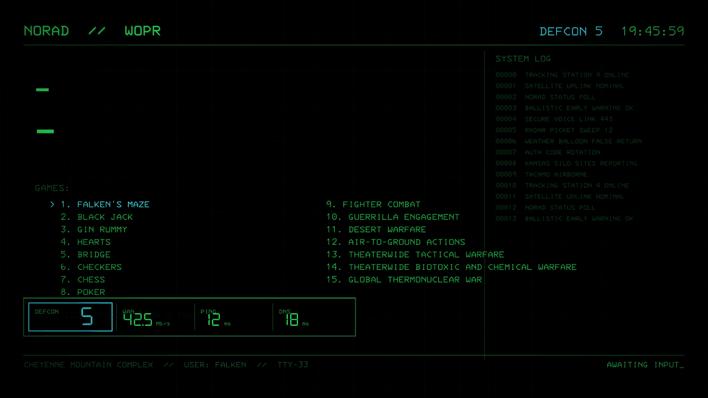

# defconmon

Retro-styled, full-screen HDMI dashboard for a Proxmox homelab, written in Rust.
Renders a "home sector defence" wall display on `CT 107` (`monitor`,
192.168.1.4), cycling five full-screen scenes with a persistent status plate
(DEFCON / WAN throughput / PING / DNS) on every screen. Replaces a conky setup;
conky stays one command away as a revert.



## Screens

Five scenes cycle, 20 s each by default. The status plate is relocated screen to
screen so no pixels are lit twice in a row (panel burn-in).

| name | shows |
|---|---|
| `wopr` | WOPR console: typewriter log, game menu, real DEFCON badge, scrolling system log |
| `defcon` | Threat board from live infra state: WAN boundary, traffic pulses, WAN throughput |
| `radar` | ATC PPI scope: rotating sweep, contacts = running PVE guests (blips, trails, data blocks) |
| `telemetry` | Oscilloscope + spectrum + readouts driven by real WAN rate and CPU |
| `vectrex` | Wireframe icosahedra, one vertex per channel (magnitude/volatility) |

All five draw the **status plate** (`hud.rs`): DEFCON, WAN, PING, DNS, colour
coded green/amber/red. The DEFCON cell anchors it so it stays recognisable at
whichever position.

## Build

x86_64 Linux only. Three configurations:

```sh
# CPU display — ships to this box
cargo build --release --bin defconmon --features live          # ~2 MB bin, ~12 MB RSS

# GPU display — for boxes where the GPU wins (see Hardware)
cargo build --release --bin defconmon --features live,gpu      # ~5.6 MB bin, ~53 MB RSS

# config server (separate process, LAN only)
cargo build --release --bin defconmon-config --features web
```

Both feature sets share one output path — build, copy, then rebuild the other.

Rendering pipeline:

- **tiny-skia** — pure-CPU vector rasteriser; **ab_glyph** — real glyph outlines
  for text. Fonts (IBM 3270, DSEG7, Px VGA, Terminus) are embedded in the binary.
- The optional GPU path (wgpu 30, GL/EGL backend) only does the nearest-neighbour
  upscale and the CRT finish; the fonts and vector art **always** rasterise on the
  CPU. The look survives with the GPU off.

## Run / deploy

Display runs under cage (Wayland) on the compositor's HDMI output via the stock
`dashboard.service` plus a **drop-in override** — the stock unit is never
rewritten. Pacing and rotation live in `/etc/defconmon/config.json`, not the
unit, so tuning needs no restart.

| unit | runs |
|---|---|
| `dashboard.service` + `dashboard.service.d/defconmon.conf` | `cage -- /usr/local/bin/defconmon --config /etc/defconmon/config.json` |
| `defconmon-config.service` | `/usr/local/bin/defconmon-config --config /etc/defconmon/config.json --serve 8080` |

### Revert to conky — one command

```sh
rm /etc/systemd/system/dashboard.service.d/defconmon.conf
systemctl daemon-reload && systemctl restart dashboard.service
```

The preserved conky config stays at `/usr/local/etc/dashboard/conky.classic.conf`;
copy it back over `~dashboard/.config/conky/conky.conf` if the stock unit reads
one.

## Config

Flat key/value JSON at `/etc/defconmon/config.json`. The display polls its mtime
once a second and reloads — that file is the **only** channel between the config
server and the display, so a crashed web server cannot take the display down.

```json
{
  "defcon.pulse_rate": 0.9,
  "display.dwell": 20,
  "display.fps": 15,
  "display.screens": "wopr,defcon,radar,telemetry,vectrex",
  "hud.visible": true,
  "radar.sweep_rpm": 8.6,
  "telemetry.full_scale": 100,
  "vectrex.spin": 100,
  "wopr.log_rows": 14
}
```

Authoritative schema in `src/config.rs`. Sections:

| key | kind | default | note |
|---|---|---|---|
| `display.fps` | int 4..30 | 12 | whole cost scales with this |
| `display.dwell` | int 5..300 | 20 | seconds per screen |
| `display.screens` | text | `wopr,defcon,radar,telemetry,vectrex` | comma order; drop one to take it out |
| `hud.visible` | bool | true | status plate on all screens |
| `gpu.mode` | choice | `auto` | `auto` / `on` / `off` (see Hardware) |
| `wopr.log_rows` | int | 14 | |
| `defcon.pulse_rate` | float | 0.9 | |
| `radar.sweep_rpm` | float | 8.6 | |
| `telemetry.full_scale` | float | 100 | |
| `vectrex.spin` | int | 100 | |

**Config web server** — separate process, `web` feature, std-only HTTP + htmx
(no web framework, no dependencies). Plain HTTP on the LAN, no auth, by design.
Edits `config.json`; validation is atomic (coercion and range checks before
anything is written). The UI walks the schema and never names a screen or metric,
so a new setting is one line in the screen that consumes it and a new screen
needs no UI change.

## Hardware / GPU

Honest numbers, measured on this box (Radeon HD 7450 / Caicos, TeraScale 2, Mesa
r600 GL backend):

- **GPU path: 14.5% of one core** vs **~10% for the tuned CPU pass**. The
  per-frame texture upload plus GL submission costs more than the CPU mask pass.
- Hence `gpu.mode=auto`: the GPU is used only where it is likely to win — a
  non-GL backend (Vulkan/Metal/DX12) or a discrete GL card. Integrated + GL falls
  back to the CPU.
- The **lean CPU build ships to this box**; the GPU binary stays in the tree
  behind `live,gpu` for machines with real GPU headroom, where it wins.

Two rules the dashboard is held to:

- **Decorative is fine; contradictory is not.** A screen may be pure fiction (the
  WOPR log is NORAD chatter), but no screen may display a value that contradicts
  measurable state. Real signal loss came from violating this (`DEFCON 3`
  hardcoded while the board computed the real level, two screens disagreeing on
  the time).
- **Portability.** The CPU path is pure Rust, no `cfg(target_arch)`, no SIMD
  intrinsics — it runs anywhere. Nothing user-visible depends on the GPU.

## Versioning

The git tag is the source of truth and is injected at compile time by `build.rs`
— never hardcoded. Releases are cut manually; see
[docs/RELEASING.md](docs/RELEASING.md).

## Measuring

```sh
./defconmon --bench 40 --screen radar --scale 0.5   # ms/frame for one screen
./defconmon --list                                 # screen registry
./defconmon --params                               # full schema
./defconmon --screen wopr --t 7.3 --out wopr.png   # headless frame
```

`--t SECONDS` is the scene clock, so any frame of the animation can be inspected.
Stop the live service before benchmarking — single-core container.

## Inspiration

WarGames' 1983 WOPR, the Vectrex vector console, the DEFCON strategy game, and
air-traffic-control approach displays: phosphor green, scanlines, range rings,
threat boards. The wall reads like the house is running its own NORAD — which,
on a home network, it more or less is.